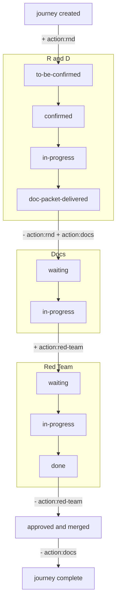

# Logos Journeys

Website to track priorities of journeys for Logos Eco Dev, on Logos R&D.

Pre-configured for [logos-co / project 12](https://github.com/orgs/logos-co/projects/12/views/1?layout_template=board).

## Usage

For Logos R&D Leads.

1. Go to https://journeys.logos.co or [run locally](#run-locally).
2. Follow instructions to enter GitHub PAT Token.
3. **Filter by team**: Click on your team in the "Team:" line.
4. **Filter by action needed**: use the filter bar at the top to show only journeys where your team has an open action: `action:rnd`.
5. **Expand a journey**: click any row to open the detail panel. It shows the full workflow state for R&D, Doc Packet, Documentation, and Red Team.
6. **Enable editing**: click the **Edit** button in the header. Once active, the button shows **Editing** in coral.
7. **Fill in missing information**: with editing enabled, each workflow section shows an input field. Paste the relevant URL or value and press Enter (or click ✓) to save directly to the GitHub issue.

> **Settings** (gear icon): change the owner, project number, or token at any time.

### Missing Information for R&D Logos Lead

See [How a journey progresses](#how-a-journey-progresses) to understand the full flow.
As a first step, Logos R&D Lead need to:

1. Verify their journey are correct, with the right target release
2. Ensure there are no missing journey. Click "+ New Journey" to add a journey in **Editing** mode.
3. Expand a journey (start from the top).
   1. If the software is already delivered, jump to "doc packet" and fill in the GitHub issue tempalte
   2. For software yet to be done, start with the "R&D" section, and enter a link to the milestone. Once known, enter the date.

## How a journey progresses

Each journey moves through three stakeholder stages. R&D and Docs run sequentially; Docs and Red Team overlap during the review phase:

| Stage        | States                                                                   |
|--------------|--------------------------------------------------------------------------|
| **R&D**      | `to-be-confirmed` → `confirmed` → `in-progress` → `doc-packet-delivered` |
| **Docs**     | `waiting` → `in-progress` → `merged`                                     |
| **Red Team** | `waiting` → `in-progress` → `done`                                       |



1. **R&D** fills in their team, a roadmap milestone link, and an estimated date. Once the feature implementation is complete, they [open an issue using the doc packet template](https://github.com/logos-co/logos-docs/issues/new?template=doc-packet.yml), fill it in (including appointing a Subject-Matter Expert (SME) from their team), then paste the issue URL into the `- link:` field in the `## Doc Packet` section. This signals hand-off to Docs.
2. **Docs** opens two items in the logos-docs board:
   - A tracking issue assigned to the R&D SME, back-linked to the journey.
   - A PR assigned to the writer and linked to the issue. This is where the writing happens. The document progresses through `stub → unverified draft → verified by SME → verified by Red Team` on this PR, with the R&D SME and Red Team reviewing directly on it.

   When the PR is approved, Docs merges it, which automatically closes the linked issue.
3. **Red Team** gets the `action:red-team` label as soon as docs work is in progress (a doc PR exists). They dogfood the journey and review the docs PR at the same time; once dogfooding is done, so is the PR review. They close their tracking issue when done.

The app tracks these states automatically by reading the issue body and checking GitHub issue/PR states. The `action:rnd`, `action:docs`, and `action:red-team` labels are kept in sync automatically; they tell each team at a glance when it's their turn. A ⚠ badge on a row means the labels are stale and will be corrected the next time the issue is opened in edit mode.

## Run locally

```sh
npx serve .
```

Then open http://localhost:3000.

> The app uses ES modules and must be served over HTTP; opening `index.html` directly as a `file://` URL will not work.

## Licence

Licensed under either of [MIT](LICENSE-MIT) or [Apache 2.0](LICENSE-APACHE) at your option.

## Deploy

Pushes to `main`/`master` auto-deploy via GitHub Actions → GitHub Pages.

Enable Pages in the repo settings under **Settings → Pages → Source: GitHub Actions** before the first deploy.
